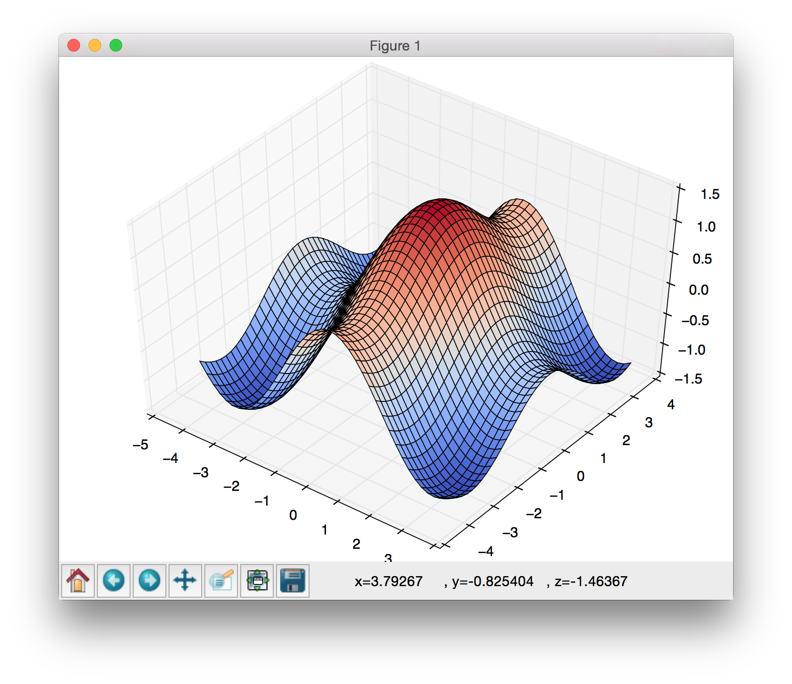

# plot_tool_py
A for plotting and efficitenly examining 2D and 3D functions.

# Screenshot

# Commands
  * C
  * zo,zi,zr, z ...
  * ro,ri
  * co,ci
  * reso,resi
  * rmso, rmsi
  * w
  * s
  * c ...
  * x
  * zl,zu,zm,zx
  * zzi,zzo,zzr
  * f
  * lwo, lwi, lw ...
  * y
  * Z
  * >,<
  * [?
  * Enter
  * p
  * P
  * S
  * :?
  * R
  * ra, rr, rd
  * :* ...
  * : ...
  * o ...
  * cx,xy,cc, cp ...
  * D
  * =
  * @p ...
  * @ ...
  * @cc
  * (a number) Enter
